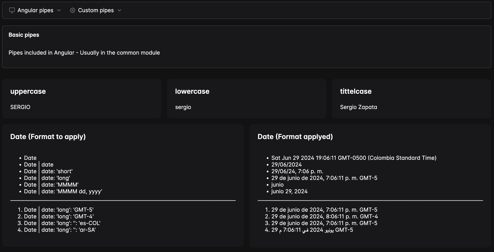
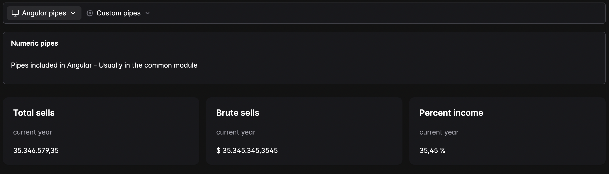
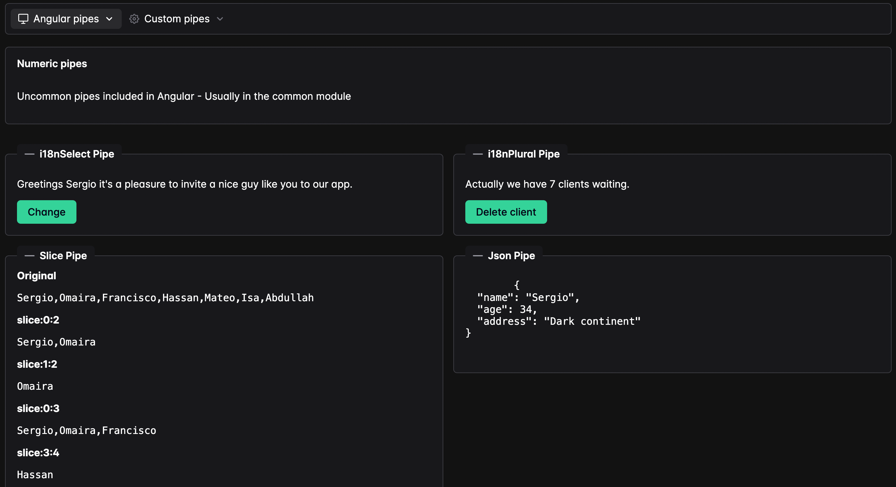
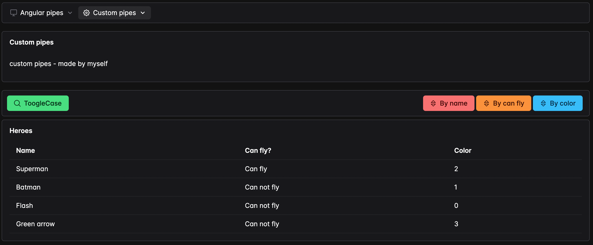

# PipesApp

This project was generated with [Angular CLI](https://github.com/angular/angular-cli) version 18.0.3 to test new features of this version and the PrimeNG style library.

## Getting Started

### Prerequisites

Make sure you have the following installed on your local machine:

- Node.js (version 20 or higher)
- Angular CLI (version 18.0.3)

### Installation

1. Clone the repository:

    ```bash
    git clone https://github.com/sergio8016/pipes-app.git
    ```

2. Navigate to the project directory:

    ```bash
    cd pipes-app
    ```

3. Install the dependencies:

    ```bash
    npm install
    ```

### Running the Application

1. Start the development server:

    ```bash
    ng serve
    ```

2. Open your browser and navigate to `http://localhost:4200/`.

The application will automatically reload if you make any changes to the source files.

## Deployed Application

You can view the deployed application at [PipesApp on GitHub Pages](https://sergio8016.github.io/pipes-app/).

## Screenshots

Here are some screenshots of the application:







## License

This project is licensed under the MIT License - see the [LICENSE](LICENSE) file for details.

## Further Contact

If you are interested in working with me, you can reach out via email at sergio8016@gmail.com.
